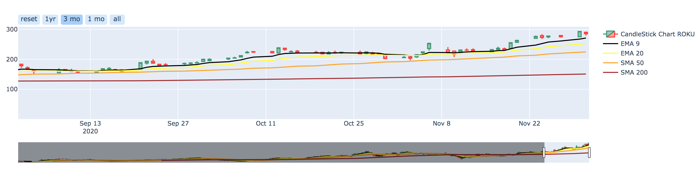
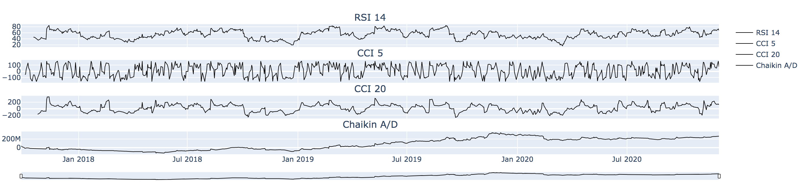
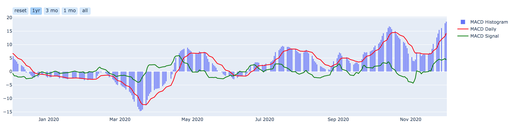
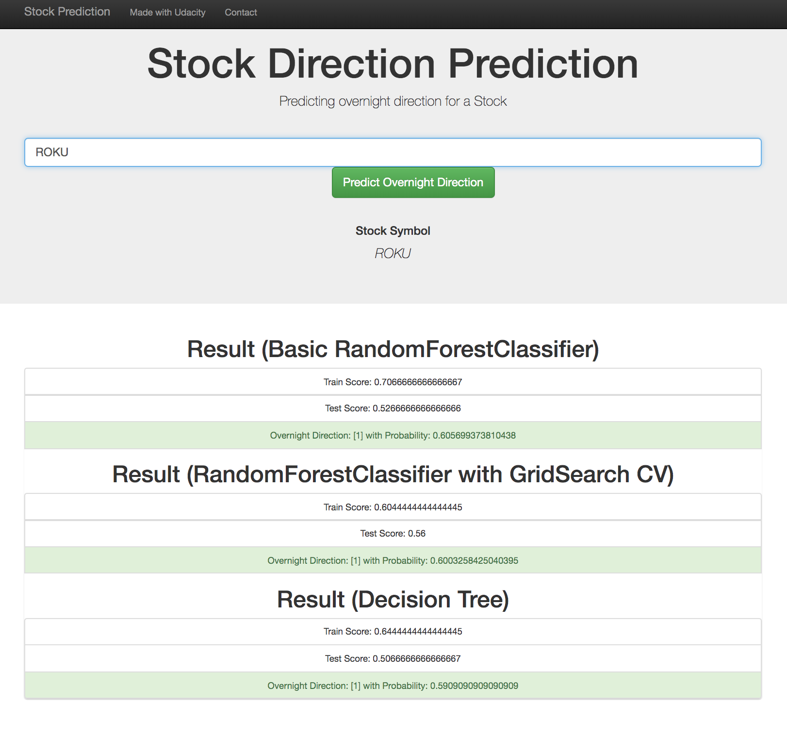
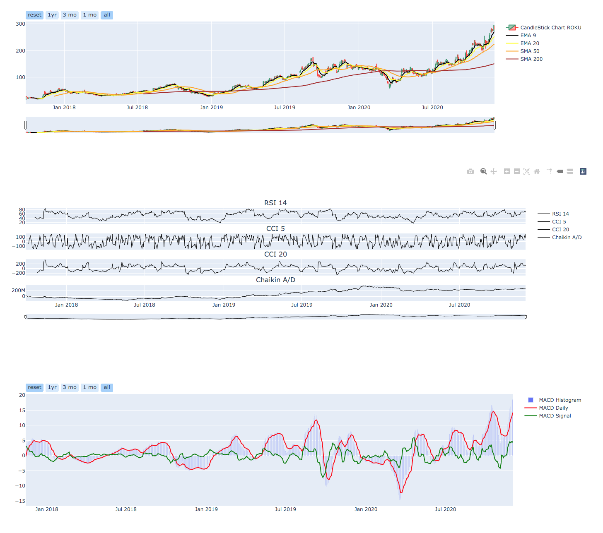

# Capstone Project : Overnight Stock Direction Prediction

## Project Motivation

This project leverages the skills learnt in Udacity's Data Science Nanogegree Program to build a model that predicts the overnight direction of a stock in the US stock market.

## Project Definition

### Project Overview:
This project involves investigation and research aiming to put together an application that uses data science techniques to visualize stock charts and             predict overnight direction of the stock.

### Problem Statement:
        
1. Generally human traders would look at a bunch metrics, trends to analyze and make trading decisions
        
2. An attempt was made to train different model types to predict the overnight direction of the stock so that a trader can make caluclated decisions

### Metrics:
        
1. Data source is Alphavantage API: https://www.alphavantage.co/documentation/
        
2. Metrics extracted/calculated: Levels, Simple Moving Average, Exponential Moving Average, Relative Strength Index, Commodity Channel Index, Moving                                                Average Convergence Divergence, Chaikin Accumulation/Distribution, Direction

3. Metric Direction is the predictor and the rest are the features

## Project Analysis

### Data Exploration:

#### Metrics:

a. Levels: Open, Close, High and Low Daily price levels of a stock

b. Simple Moving Average (SMA): Trailing simple moving average of close level of a stock for a time period

c. Exponential Moving Average (EMA): Trailing exponential moving average of close level of a stock for a time period

d. Relative Strength Index (RSI): Metric within range 0 to 100 where a score of above 80 represents stock is overbought and below 20 represents that                                                   the stock is oversold

e. Commodity Channel Index (CCI): Metric similar to RSI which denotes overbought and oversold levels

f. Moving Average Convergence Divergence (MACD): Metric showing the Convergence and Divergence between 12 period SMA and 26 period SMA to get an                                                                      early indication of whether the stock is largely being sold or bought

g. Chaikin Accumulation/Distribution (Chaikin A/D): Metric showing whether the money flow is into the stock or away from the stock

h. Direction: ((Today's Open level) - (Yesterday's Close level))/(Yesterday's Close level) > 1 ? 1 : -1

### Data Visualization:
        
Three graphs are used to visualize all the available data in an efficient and intuitive manner

a. Candlestick Diagram for stock price levels with SMA/EMA

b. RSI, CCI and Chaikin A/D are the percentage plots showing overbought and oversold levels

c. MACD is the histogram plot indicating Convergence/Divergence of the SMAs

## Methodology

1. Alphavantage is a repository of free APIs for upto the minute streaming data and 20 years of historical data. APIs are grouped into four categories: 1.             Equity 2. Currencies (including cryptocurrencies) 3. Sectors and 4. Technical indicators. Run by a tight-knit community of researchers, engineers, and               business professionals. JSON is the default data format with CSV format also supported. Data from this source requires extensive processing before it can           used in financial data analysis

2. Since Direction is a forward looking parameter which also serves as our predictor, first data row was eliminated from the calculation

3. Last Row (present day) of dataset is used as an input so that the model can predict the direction parameter for the given input set

## Challenges

1. A free version of Alphavantage API was used to query the data. It only allows 5 requests per minute at this time and that is why a sleep time of 60 seconds has      been added every 5 requests. This would lead the webpage application to load and display results only after a couple of minutes

2. Since model and its prediction is very stock specific, model training was done on the fly

## Results

1. Three Model scenarios were implemented to evaluate accuracy:
    
    a. RandomForestClassifier
    
    b. RandomForestClassifier with GridSearch CV
    
    c. Decision Trees
    
2. Training and Testing Accuracy score for each of the scenarios is reported on the web page

## Conclusion

It was seen that model accuracy with RandomForestClassifier was good and was further improved by tuning hyperparameters using GridSearch CV. However, best resulsts were experienced with Decision Tree Model

## File Description

    .
    ├── app     
    │   ├── run_app.py                       # Flask file that runs app
    │   └── templates   
    │       ├── go.html                      # Prediction result page of web app
    │       └── master.html                  # Main page of web app    
    ├── data
    │   └── dataprocess.py                   # Data cleaning and preprocessing
    ├── model
    │   └── trainmodel.py                    # Train ML model           
    └── README.md

## Instructions

1. Run the following command in the app's directory to run your web app. (Python 3.*)
    `python run_app.py`

2. Go to http://localhost:4200/

## Example

