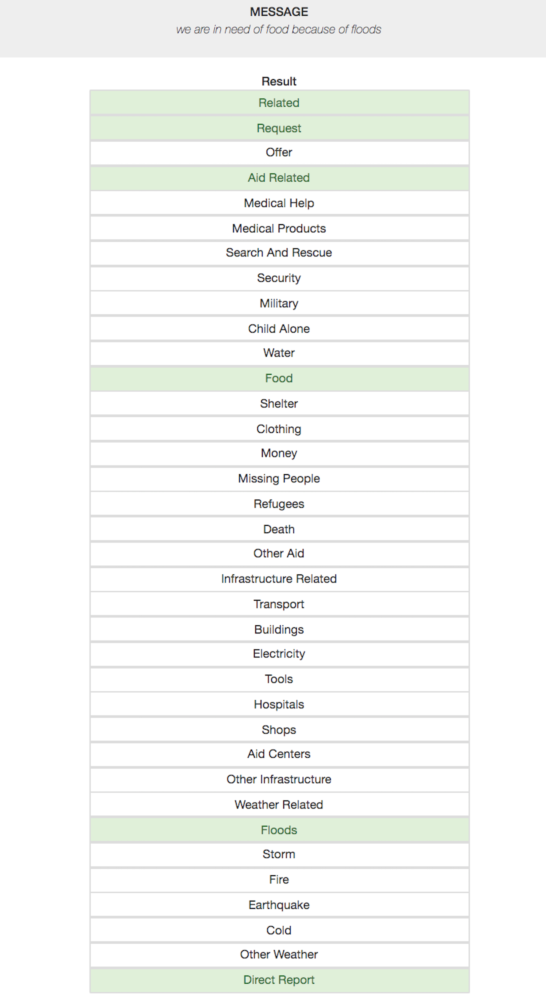

# Disaster Response Pipeline Project

## Project Motivation

This project applies Data Engineering skills to analyze disaster data from Figure Eight to build a model for an API that classifies disaster messages.

## File Description

    .
    ├── app     
    │   ├── run.py                           # Flask file that runs app
    │   └── templates   
    │       ├── go.html                      # Classification result page of web app
    │       └── master.html                  # Main page of web app    
    ├── data
    │   ├── ETL Pipeline Preparation.ipynb   # Jupyter notebook for ETL Pipeline Preparation 
    │   ├── disaster_categories.csv          # Dataset including all the categories  
    │   ├── disaster_messages.csv            # Dataset including all the messages
    │   └── process_data.py                  # Data cleaning
    ├── models
    │   ├── ML Pipeline Preparation.ipynb   # Jupyter notebook for ML Pipeline Preparation
    │   └── train_classifier.py              # Train ML model           
    └── README.md
    

## Instructions
1. Run the following commands in the project's root directory to set up your database and model.

    - To run ETL pipeline that cleans data and stores in database
        - Format:  `python data/process_data.py <path to messages csv> <path to categories csv> <path to SQL DB> <SQL Table Name>`
        - Example: `python data/process_data.py data/disaster_messages.csv data/disaster_categories.csv data/ETLDB.db ETLTable`
    - To run ML pipeline that trains classifier using model type from (clf, kn, customtrans) and GridSearch (True or False) and saves pickle file
        - Format:  `python models/train_classifier.py <path to SQL DB> <path to PKL File> <SQL Table Name> <Model Type> <Enable/Disable Grid Search>`
        - Example: `python models/train_classifier.py data/ETLDB.db models/clf_grid_search_cv.pkl ETLTable clf True`

2. Run the following command in the app's directory to run your web app.
    `python run.py`

3. Go to http://localhost:4200/

## Example

## Generated PKL Files
https://view6fc3e9d1.udacity-student-workspaces.com/tree/Project%202%3A%20PKL%20Files
